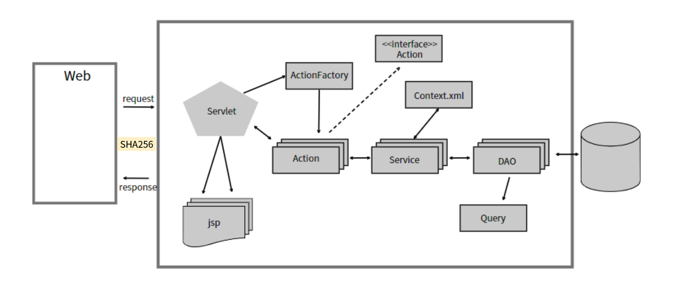

# 01 — Environment Setup

## Overview

This document describes the process of restoring a legacy Java-based web application for use as a security analysis target. Only the original project source files remained on a local drive; the original runtime environment (application server, database, and system configuration) was no longer available.

The objective of this phase is not functional enhancement, but faithful reconstruction of an execution environment that reflects the original design and operational constraints. This restored environment serves as the baseline for subsequent attack and defense experimentation.

---

## Background and Motivation

The project originated as a personal CRUD-centric web service developed using Eclipse and deployed in a local environment. After the development period, only the project directory was preserved. No virtual machines, database instances, or server configurations were retained.

Rather than rebuilding the system using modern frameworks or cloud-native components, this effort intentionally preserves the legacy structure. The rationale is to analyze realistic security risks commonly found in still-operational legacy Java web systems.

---

## Software Architecture (Logical)

The target application follows a traditional three-tier architecture with a monolithic design and CRUD-focused functionality.

* **Client Tier**: Web browser issuing HTTP requests
* **Application Tier**: Apache Tomcat 8.0.30 executing JSP and Servlet components
* **Data Tier**: Oracle Database (XE), accessed via a JNDI-based JDBC DataSource

Request flow is linear and synchronous: client requests are handled directly by JSP/Servlet components, which interact with the database for create, read, update, and delete operations. Business logic and persistence logic are not strictly separated, increasing reliance on correct input handling at the web layer.

### Logical Architecture Diagram

## Technology Stack

The following technologies were identified through source code and configuration analysis:

* **Programming Language**: Java 1.8.0
* **Web Technology**: JSP / Servlet (Eclipse WTP Dynamic Web Project)
* **Application Server**: Apache Tomcat 8.0.30
* **Database**: Oracle Database XE (JNDI JDBC DataSource)
* **Development Tools**: Eclipse (original), Visual Studio Code (analysis and restoration)
* **Version Control**: Git / GitHub
* **Host Operating System**: Windows11 (local environment)
* **Alternative Runtime Consideration**: Docker-based database deployment

The absence of a modern framework (e.g., Spring MVC) is intentional and reflects the original implementation context.

---

## Environment Reconstruction Attempts

### Application Server

Apache Tomcat 8.0.30 was selected to match the servlet API level and configuration expected by the project. Manual configuration of context and DataSource settings was required due to missing deployment documentation.

### Database Setup (Oracle)

The project configuration references an Oracle JDBC DataSource, indicating reliance on Oracle Database in the original environment. Native installation attempts of Oracle XE on Windows resulted in repeated installer failures.

Observed issues included:

* MSI installer errors during file extraction and script execution
* Dependency on temporary directories within non-ASCII (Korean) Windows user paths
* Inconsistent behavior despite manual TEMP directory reassignment

Detailed logs and screenshots are archived in `oracle-install-errors.md` and the `screenshots/` directory.

---

## Alternative Approaches Considered

Due to instability and reproducibility issues with native database installation, a containerized Oracle XE deployment using Docker was evaluated as an alternative.

This approach offers:

* Environment isolation
* Repeatable setup procedures
* Reduced dependency on host OS configuration

---

## Security Implications

Several security-relevant observations emerge from this environment setup phase:

* Legacy CRUD-centric architectures heavily depend on correct input validation, making them susceptible to SQL Injection, Cross-Site Scripting (XSS), and authorization flaws.
* Tight coupling between web and data layers increases the impact of single-point failures and misconfigurations.
* Environment reconstruction difficulties highlight operational security risks, including delayed patching and reduced incident response readiness.
* Containerization improves containment and reproducibility, making it a preferable platform for controlled security experimentation.

---

## Artifacts and Reproducibility

This directory includes the following supporting materials:

* `oracle-install-errors.md`: Installer error messages and analysis
* `screenshots/`: Error dialogs and setup failure evidence
* (Planned) `docker/`: Container configuration for database restoration

All commands, configuration files, and environment assumptions are documented to support reproducibility.

---

## Environment Constraints

The restoration process was performed under the following constraints:

* Only the original project source directory was available
* No infrastructure-as-code, VM images, or database backups existed
* Original deployment documentation was unavailable
* Host system used a non-English (Korean) Windows user environment

These constraints intentionally reflect realistic legacy system conditions and influence both operational and security risk analysis.

---

## Decision and Next Steps

Based on the constraints identified, the following decisions were made:

* Use a Docker-based Oracle XE instance to restore database functionality
* Preserve the original application structure without modernization

The decision to adopt a containerized database environment was driven by repeated failures in native Oracle XE installation on the host system. These failures exposed practical operational risks associated with legacy database deployment, including installer fragility, OS-level dependency issues, and poor reproducibility.

Given the increasing industry adoption of container-based workflows and their advantages in isolation, repeatability, and environment parity, Docker was selected as a pragmatic alternative rather than a modernization effort. The goal remains faithful restoration of the original system behavior, while reducing host-specific instability that could hinder controlled security experimentation.

The next phase will validate application connectivity and begin systematic attack scenario design in `02-attack-scenarios`.

