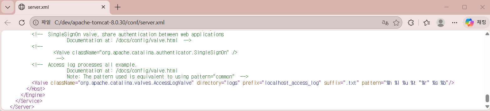
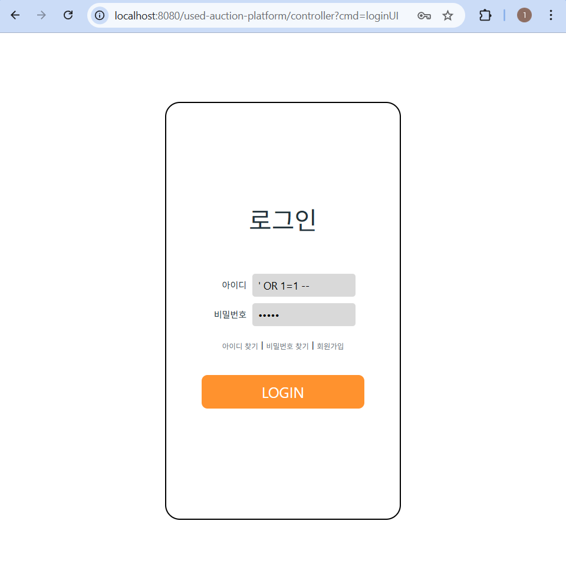
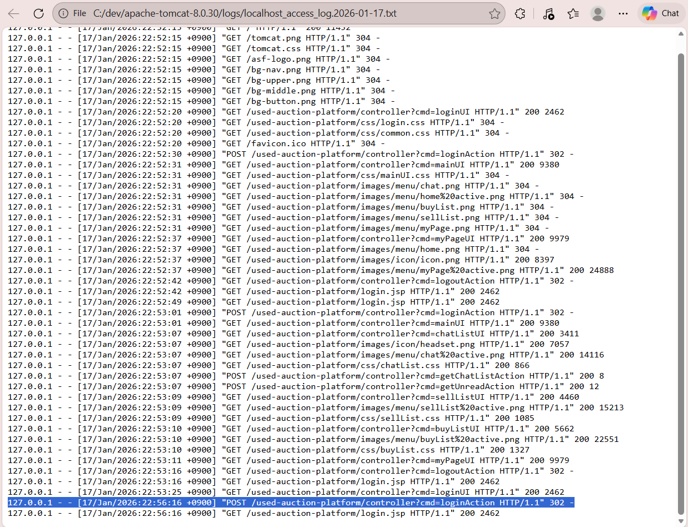

# AS-01: SQL Injection Attempt and Detection Gap Analysis

## 1. Overview

This document describes an attempted SQL Injection (SQLi) attack against a legacy Java web application implemented using JSP and Servlet architecture.

The attack was unsuccessful due to the application’s use of parameterized SQL queries.  
However, the analysis identified a significant operational issue: from a SOC perspective, existing log sources did not provide sufficient information to distinguish SQL Injection attempts from normal authentication failures.

The purpose of this scenario is to evaluate detection visibility, logging adequacy, and incident response readiness rather than exploitation success.

---

## 2. Environment

| Component | Description |
|---------|-------------|
| Application | Legacy Java Web Application (JSP / Servlet) |
| Application Server | Apache Tomcat 8.0.30 |
| Database | Oracle XE (Docker-based) |
| Architecture | Front Controller with Action-based routing |
| Log Sources | Tomcat Access Log, Tomcat Application Log (Catalina) |

---

## 3. Threat Model

### 3.1 Threat Actor

- External, unauthenticated user
- Direct access to public-facing endpoints

### 3.2 Target Asset

Authentication endpoint:


```log
POST /controller?cmd=loginAction
```
User-controlled input parameters (user ID and password) are processed by the backend authentication logic.

### 3.3 Considered Attack Scenarios

| Scenario | Description |
|---------|-------------|
| SQL Injection | Authentication bypass attempt |
| Brute Force | Repeated login attempts using multiple credentials |
| Credential Stuffing | Automated login attempts using leaked credentials |

Without additional context, these scenarios are indistinguishable based on basic access logs alone.

---

## 4. Attack Attempt

A manual SQL Injection payload was submitted through the login form to test authentication bypass behavior.

Payload used during testing:

```log
' OR 1=1 --
```

### Result

| Item                    | Outcome      |
| ----------------------- | ------------ |
| Authentication bypass   | Failed       |
| SQL error exposure      | Not observed |
| Application instability | Not observed |

The backend authentication logic utilizes parameterized queries (PreparedStatement), which prevents classic SQL Injection exploitation.

---

## 5. Evidence Collected

This section contains raw evidence collected during the SQL Injection testing process.
The purpose of these artifacts is to demonstrate that the scenario was executed in a real environment
and to support the detection gap analysis.

### 5.1 Access Log Configuration (Tomcat)

The following screenshot shows the AccessLogValve configuration defined in the application server.



This configuration records HTTP method, request URI, response status, and timestamp,
but does not capture request parameters or payload content.

---

### 5.2 SQL Injection Attempt via Login Interface

A manual SQL Injection payload was submitted through the login form during testing.



The payload was entered into the user ID field and submitted to the server.
No authentication bypass or error disclosure was observed.

---

### 5.3 Resulting Tomcat Access Log Entry

After submitting the request, the server was stopped and the corresponding access log was collected.



The log entry confirms that the request was processed by the server,
but does not provide sufficient information to distinguish malicious input from a normal login failure.

### Observations

-HTTP method, endpoint, and response status are recorded
-Request parameters are not logged
-Authentication failure reasons are not recorded
-No SQL-related error or anomaly information is available

The collected logs provide basic operational data but lack the security context required for attack identification.

---

## 6. Detection Gap Analysis

Although an SQL Injection attempt was performed, none of the available log sources allowed reliable identification of the activity as SQL Injection.

### Identified Detection Gaps

- Web access logs do not capture user input or payload patterns
- Application logs do not record authentication failure reasons
- Database-side SQL errors are not logged or correlated
- No detection rules or alerting thresholds are defined

### Impact on SOC Operations

| Area                    | Impact                                                          |
| ----------------------- | --------------------------------------------------------------- |
| Detection Accuracy      | Malicious and benign authentication failures appear identical   |
| Incident Classification | SQL Injection cannot be distinguished from brute-force attempts |
| Response Efficiency     | Manual investigation required                                   |
| Risk Exposure           | Early-stage attacks may go unnoticed                            |


From a SOC perspective, the system is technically secure but lacks sufficient monitoring visibility.

---

## 7. Logging & Detection Design (Improvement Plan)

### 7.1 Application-Level Security Logging

Design structured security logs for authentication-related events, including:

- Timestamp
- Source IP address
- Target endpoint
- Authentication result (success / failure)
- Failure category (generic, non-sensitive)

Example (conceptual):
```log
AUTH_FAIL | ip=127.0.0.1 | endpoint=/controller | reason=INVALID_CREDENTIAL
```

Sensitive information such as passwords or raw input values must not be logged.

---

### 7.2 Database Log Correlation

- Enable Oracle XE SQL error logging
- Capture abnormal SQL execution behavior
- Correlate database anomalies with repeated authentication failures

The objective is to improve confidence in attack classification through multi-layer correlation.

---

### 7.3 SIEM Integration
- Centralize application, access, and database logs using a SIEM platform
- Implement rule-based detection for:
  - Repeated authentication failures from a single source
  - Suspicious input patterns
  - Temporal correlation between authentication failures and database errors
  
Detailed implementation is documented in **`03-logging-and-detection/`**.

---

## 8. Incident Response Consideration

With enhanced detection and alerting, the following response workflow becomes feasible:

1. Automatic alert generation
2. SOC analyst triage
3. Attack type classification (SQL Injection vs brute force)
4. IP reputation analysis
5. Temporary blocking or rate-limiting
6. Incident documentation and escalation

**Detection maturity directly enables effective incident response.**

---

## 9. Lessons Learned

- Secure coding practices alone are insufficient for SOC operations
- Detection visibility is a foundational security control
- Logging must be designed with incident classification in mind
- SQL Injection defense should be evaluated from both:
  - Developer perspective
  - SOC / CERT perspective

---

## 10. Conclusion

This scenario demonstrates that a system can be resistant to SQL Injection while still being operationally blind from a monitoring standpoint.

Effective security requires not only preventive controls, but also adequate visibility to support detection and incident response activities.

---

## Evidence Index

The following artifacts were collected during the execution of AS-01:

| Evidence | Description |
|--------|------------|
| access-log-configuration.png | Tomcat AccessLogValve configuration |
| SQLi-attempt.png | Manual SQL Injection payload submission via login form |
| SQLi-tomcat-access-log.png | Tomcat access log entry corresponding to the test |

All evidence files are stored under the `detection-evidence/` directory.


